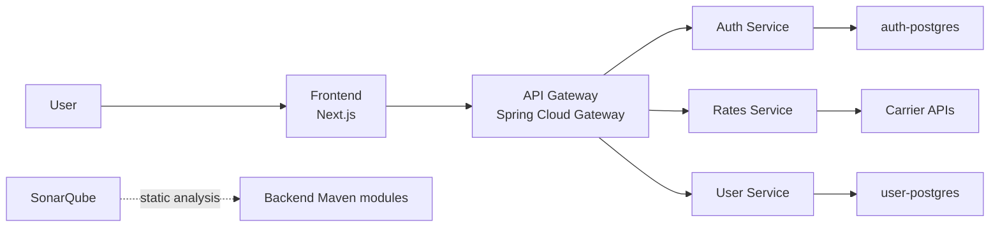

# DeliverX

DeliverX is a delivery and logistics rate aggregator. The application helps users compare shipping options by route, package dimensions, weight, delivery speed, and available carrier offers.

The project is split into a Next.js frontend and a Spring Boot microservice backend.

## Features

- Calculate delivery rates by origin, destination, weight, and package dimensions.
- Compare carrier offers by price and delivery time.
- Authenticate users with JWT.
- Store and update user profile data.
- Route frontend traffic through a single API Gateway.
- Run local infrastructure with Docker Compose.
- Build backend and frontend in GitHub Actions.
- Run static code analysis with SonarQube.

## Architecture



## Repository Structure

```text
.
|-- docker-compose.yml
|-- docs/
|   `-- api-contracts.md
|-- deliverx-backend-rates/
|   |-- pom.xml
|   |-- auth-service/
|   |-- gateway-service/
|   |-- rates-service/
|   `-- user-service/
|-- frontend/
|   |-- app/
|   |-- components/
|   `-- ui/
|-- postman/
`-- test/
```

## Services

| Service | Local URL | Description |
| --- | --- | --- |
| Frontend | `http://localhost:3000` | User interface built with Next.js. |
| API Gateway | `http://localhost:8080` | Single backend entry point and route dispatcher. |
| Auth Service | `http://localhost:8081` | Login and JWT issuing. |
| Rates Service | `http://localhost:8082` | Delivery rate calculation and carrier aggregation. |
| User Service | `http://localhost:8083` | User profile API. |
| Auth PostgreSQL | `localhost:5432` | Auth service database. |
| User PostgreSQL | `localhost:5434` | User service database. |
| SonarQube | `http://localhost:9000` | Static code analysis dashboard. |

## Tech Stack

Backend:
- Java 21/25
- Spring Boot 3.4.4
- Spring Cloud Gateway
- Spring Security with JWT
- PostgreSQL
- Maven
- Caffeine cache

Frontend:
- Next.js 16
- React 19
- TypeScript
- Tailwind CSS
- Radix UI primitives
- Lucide icons

Infrastructure and quality:
- Docker Compose
- GitHub Actions
- SonarQube
- Postman collection

## Prerequisites

- Docker Desktop
- Node.js 20+
- npm
- Java 25 recommended for building all backend services

The backend services include Maven Wrapper scripts, so a globally installed Maven is not required.

## Quick Start

Start backend infrastructure and services:

```bash
docker compose up -d
```

Start the frontend:

```bash
cd frontend
npm install
npm run dev
```

Open:

```text
http://localhost:3000
```

The frontend calls the backend through the gateway at:

```text
http://localhost:8080
```

## Backend Build

Build all backend services through the aggregator Maven project:

```bash
cd deliverx-backend-rates
./auth-service/mvnw -f pom.xml verify -DskipTests
```

Build a single service:

```bash
cd deliverx-backend-rates/auth-service
./mvnw clean package -DskipTests
```

Replace `auth-service` with `rates-service`, `gateway-service`, or `user-service` as needed.

## Frontend Build

```bash
cd frontend
npm install
npm run build
```

Run linting:

```bash
cd frontend
npm run lint
```

## SonarQube

SonarQube is configured in `docker-compose.yml` and in the backend Maven aggregator.

Start SonarQube:

```bash
docker compose --profile quality up -d sonarqube
```

Open:

```text
http://localhost:9000
```

Default login:

```text
admin / admin
```

After the first login, change the password and create an analysis token. Then run:

```bash
cd deliverx-backend-rates
export SONAR_TOKEN=<your-token>
./auth-service/mvnw -f pom.xml verify -Psonar -DskipTests
```

The analysis checks the backend code for bugs, vulnerabilities, code smells, maintainability issues, duplication, and security hotspots. Results are visible in the SonarQube dashboard under the `deliverx-backend` project.

## API

Detailed API examples are documented in:

```text
docs/api-contracts.md
```

Main routes through the gateway:

| Method | Path | Description |
| --- | --- | --- |
| `POST` | `/auth/login` | Authenticate user and receive JWT. |
| `POST` | `/api/auth/login` | Same auth route through gateway predicate. |
| `POST` | `/rates/calculate` | Calculate delivery rates. |
| `GET` | `/users/me` | Get current user profile. |
| `PUT` | `/users/me` | Update current user profile. |

Protected endpoints require:

```text
Authorization: Bearer <JWT>
```

## CI

GitHub Actions workflow:

```text
.github/workflows/ci.yml
```

The CI pipeline:
- builds each backend service with Maven;
- installs frontend dependencies;
- builds the Next.js frontend.

## CD

GitHub Actions workflow:

```text
.github/workflows/cd.yml
```

The CD pipeline runs after the `CI` workflow succeeds on `main`, `master`, or `integrate-all`. It builds Docker images for all backend services and the frontend, then pushes them to GitHub Container Registry:

```text
ghcr.io/<github-owner>/deliverx-auth-service
ghcr.io/<github-owner>/deliverx-rates-service
ghcr.io/<github-owner>/deliverx-gateway-service
ghcr.io/<github-owner>/deliverx-user-service
ghcr.io/<github-owner>/deliverx-frontend
```

Images are tagged with:
- `sha-<short-commit-sha>`;
- the branch name;
- `latest` for `main` or `master`.

For a server deployment, use `docker-compose.prod.yml` with a `.env` file that defines:

```text
IMAGE_REGISTRY=ghcr.io/<github-owner>
IMAGE_TAG=latest
AUTH_DB_PASSWORD=<password>
USER_DB_PASSWORD=<password>
APP_JWT_SECRET=<secret-at-least-32-chars>
```

Then run:

```bash
docker compose -f docker-compose.prod.yml pull
docker compose -f docker-compose.prod.yml up -d
```

If the frontend must call a deployed gateway URL, set the GitHub repository variable:

```text
NEXT_PUBLIC_API_BASE_URL=http://<server-host>:8080
```

## Useful Commands

Show running containers:

```bash
docker compose ps
```

View service logs:

```bash
docker compose logs -f gateway-service
```

Stop all Docker Compose services:

```bash
docker compose down
```

Stop services and remove local volumes:

```bash
docker compose down -v
```

## Project Status

DeliverX is an active educational/service prototype. Current implementation covers authentication, profile management, rate calculation, API gateway routing, CI build checks, and SonarQube static analysis setup.
